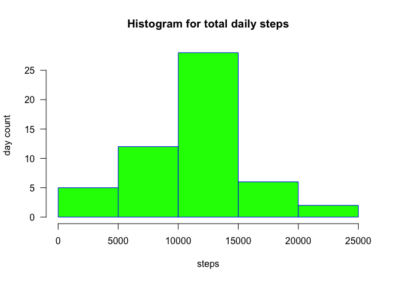
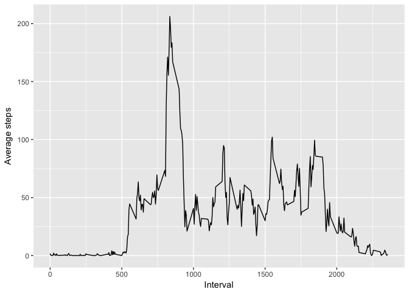
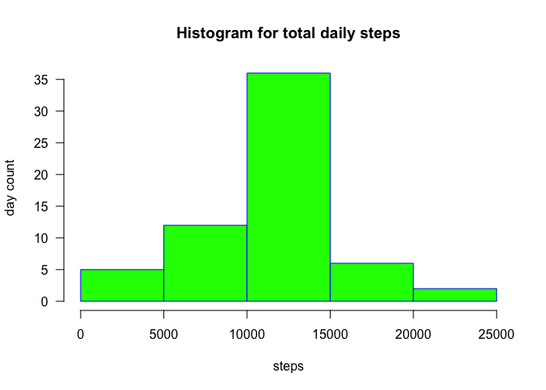
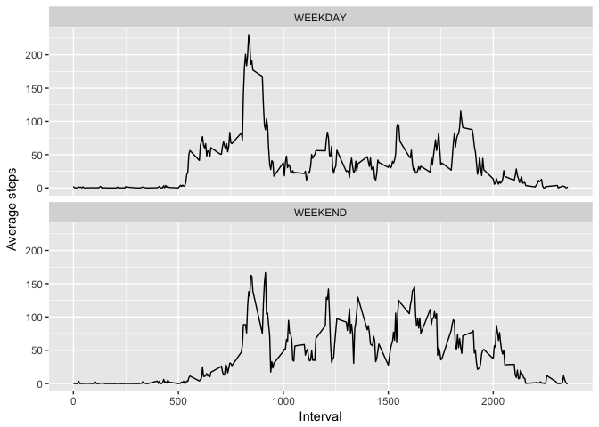

# Reproducible Research: Peer Assessment 1


## Loading and preprocessing the data
1. This code chunk will unzip the archive file and read the data from the csv file
into the program.  This process assumes that activity.zip is located in the working directory.  


```r
unzip("./activity.zip")
raw <- read.csv("./activity.csv")
head(raw)
```

```
##   steps       date interval
## 1    NA 2012-10-01        0
## 2    NA 2012-10-01        5
## 3    NA 2012-10-01       10
## 4    NA 2012-10-01       15
## 5    NA 2012-10-01       20
## 6    NA 2012-10-01       25
```
## What is mean total number of steps taken per day?
1. Using the dplyr package, summarize the raw data read from file, grouping by date.
2. Use the hist function to create a histogram of the total steps, formatting the labels and colors to improve readabilty.
3. Calculate mean and median for step totals and print the output, using the na.rm = TRUE option to avoid missing values in the data set.


```r
library(dplyr)
```

```
## Warning: package 'dplyr' was built under R version 3.4.2
```

```
## 
## Attaching package: 'dplyr'
```

```
## The following objects are masked from 'package:stats':
## 
##     filter, lag
```

```
## The following objects are masked from 'package:base':
## 
##     intersect, setdiff, setequal, union
```

```r
sumraw <- raw %>% group_by(date) %>% summarize(sum(steps))
names(sumraw) <- c("date", "totalsteps")

hist(sumraw$totalsteps, 
     main="Histogram for total daily steps", 
     xlab="steps",
     ylab="day count",
     border="blue", 
     col="green",
     las=1 
     )
```

<!-- -->

```r
stepsmean <- mean(sumraw$totalsteps, na.rm = TRUE)
print(c("Mean total steps for all days: ", stepsmean) )
```

```
## [1] "Mean total steps for all days: " "10766.1886792453"
```

```r
stepsmedian <- median(sumraw$totalsteps, na.rm = TRUE)
print(c("Median total steps for all days: ", stepsmedian) )
```

```
## [1] "Median total steps for all days: " "10765"
```


## What is the average daily activity pattern?
1. The raw data is summarized to find the mean steps for each interval, omitting missing values.
2. Using the ggplot2 package, we graph a time series plot, showing the average steps per interval with a single line.
3. The highest average number of steps is found and used to determine the interval that relates to it, answering the question, across all days, which is the interval with the highest average number of steps.  This is printed outside of the code chunk using a {r varname} reference.


```r
library(ggplot2)

suminterval <- raw %>% group_by(interval) %>% summarize(mean(steps, na.rm = TRUE))
names(suminterval) <- c("interval", "averagesteps")
ggplot(suminterval, aes(interval, averagesteps)) + geom_line() + 
        xlab("Interval") + ylab("Average steps")
```

<!-- -->

```r
maxinterval <- suminterval %>% 
        filter(averagesteps == max(suminterval$averagesteps)) %>%
        select(interval)
```
The interval with the most average steps over days observed is 835

## Imputing missing values

During investigation of the data it was found that some of the records had 
missing steps data.  The following analysis will identify the extent of the
missing data.  We will also use the average steps for the common interval
to fill in the missing data.

1. All rows are checked for missing values and stored in a variable.  The number of rows with missing values is printed.
2. The raw data is combined (using merge) with the average time recorded across all days for the same interval.  i.e. the average for interval 10 is added to all rows in the raw data.
3. We loop through all of the records using a for loop, checking to see if steps is missing a value.  If so, we move the value from the averagesteps column into the steps column.  After this step, we have either the actual steps recorded or the average for that time interval.  There will not be any more missing values.
4. The data is summarized by date and a similar histogram to an earlier step is produced, along with the mean and median steps for all days.
5. After processing and imputing the missing data, we see a slight variance in the
mean and median steps values, but not enough to see a difference in the
histogram.


```r
#Collect all rows with missing values
missingvals <- raw[rowSums(is.na(raw)) > 0,]

print(c("Number of observations with missing values: ", nrow(missingvals)) )
```

```
## [1] "Number of observations with missing values: "
## [2] "2304"
```

```r
#Append the average steps for the interval into a new data set
withavg <- merge(raw, suminterval, by = "interval")

#loop thru the data set and copy the average steps to the steps col when data
#is missing (rounded to the nearest whole number)

for (i in 1:nrow(withavg)){
        if (is.na(withavg[i,]$steps)){
                withavg[i,]$steps <- round(withavg[i,]$averagesteps)
        }
        
                
}

#Summarize the data with imputed values by date and create a histogram
sumwithavg <- withavg %>% group_by(date) %>% summarize(sum(steps))
names(sumwithavg) <- c("date", "totalsteps")

hist(sumwithavg$totalsteps, 
     main="Histogram for total daily steps", 
     xlab="steps",
     ylab="day count",
     border="blue", 
     col="green",
     las=1 
     )
```

<!-- -->

```r
stepsmean <- mean(sumwithavg$totalsteps, na.rm = TRUE)
print(c("Mean total steps for all days: ", stepsmean) )
```

```
## [1] "Mean total steps for all days: " "10765.6393442623"
```

```r
stepsmedian <- median(sumwithavg$totalsteps, na.rm = TRUE)
print(c("Median total steps for all days: ", stepsmedian) )
```

```
## [1] "Median total steps for all days: " "10762"
```


## Are there differences in activity patterns between weekdays and weekends?
1. We load the lubridate package which is handy for manipulating dates
2. We add a new column to the data set we created in a previous step (that has a step value filled in for all observations) that indicates whether the date falls on a weekend or weekday.  This is complted with a call to the wday function of the lubridate package.  Data is then grouped by interval and dayofweek ("WEEKEND" or "WEEKDAY") and the mean is calculated for each grouping.
3. Using ggplot2 we create a time series panel plot with two panels, one each for "WEEKEND" and "WEEKDAY" data.
4. We can see with the panel plot subjects are more active in the morning (around 8am) on the weekdays when compared with weekends.  We can also see that subject is slightly more active during the day on the weekend, probably because subject isn't working.


```r
library(lubridate)
```

```
## Warning: package 'lubridate' was built under R version 3.4.2
```

```
## 
## Attaching package: 'lubridate'
```

```
## The following object is masked from 'package:base':
## 
##     date
```

```r
suminterval <- mutate(withavg, dayofweek = ifelse (
                        wday(ymd(date))
                         %in% c(1,7), "WEEKEND","WEEKDAY"
                )
                ) %>% group_by(interval, dayofweek) %>% 
                        summarize(mean(steps))

names(suminterval) <- c("interval", "dayofweek", "averagesteps")

ggplot(suminterval, aes(x = interval, y = averagesteps, group = dayofweek )) +         geom_line() + 
        xlab("Interval") + 
        ylab("Average steps") + 
        facet_wrap( ~ dayofweek, nrow = 2)
```

<!-- -->
